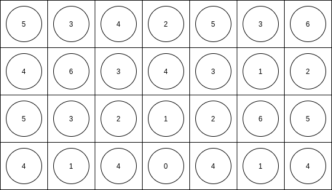
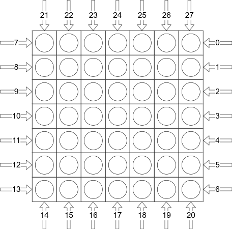

# Protocol format

Messages between servers and clients are strings encoded in the UTF-8 charset.
Each message ends with a newline character (`\n` in Java).

- `<argument>` required argument.
- `<argument>^n` required argument precisely n times. 
- `[argument]` optional input or argument.
- `[argument]*` optional input or argument 0 or more times.

# List of commands

## List of all server-side commands
- [HELLO](#hello-server)
- [LOGIN](#login-server)
- [ALREADYLOGGEDIN](#alreadyloggedin-server)
- [LIST](#list-server)
- [NEWGAME](#newgame-server)
- [MOVE](#move-server)
- [GAMEOVER](#gameover-server)

## Client-side commands
- [HELLO](#hello-client)
- [LOGIN](#login-client)
- [LIST](#list-client)
- [QUEUE](#queue-client)
- [MOVE](#move-client)

# Command format
The different arguments of commands are separated by a tilde ("`~`"). A tilde is never allowed as part of any argument, except if explicitly indicated otherwise. All other characters, such as spaces, are allowed.

Commands are separated by newlines. These newlines are omitted from the descriptions below.  

# Extension handling
In the arguments of the `HELLO` commands, both server and client indicate their supported extensions. During the remainder of the connection, both parties respect this by only sending commands they know the other party supports. For example, global chat messages are only delivered to those clients supporting the `CHAT` extension. Similarly, the client will not send a public key with `LOGIN` if it has seen that the server does not support the `AUTH` extension. 

# Error handling
When provided with illegal inputs, the server or client can respond with an error. The command that triggered the error will otherwise be discarded within the server or client. For example, when a client sends a `MOVE` but the move is not a legal move of the current player, then an `ERROR` is sent as the client could have known that the move would be illegal. 

*Syntax*: `ERROR[~description]`

The description is entirely optional. It can be added for debugging convenience. It should explicitly *never* be shown to the user, since its contents are unknown when connecting with software produced by a different group.

# Initialization sequence
Before being able to play games, server and client need to exchange information. This is done during the initialization sequence. No other commands are allowed until the initialization sequence has completed. 

## HELLO (client)
The initial message sent by the client once a connection has been established. 

*Syntax*: `HELLO~<client description>[~extension]*`

The client description should be a short string. The client indicates which extensions are supported by including the relevant extension string at the end. Extensions are given in arbitrary order. 

### Examples
- `HELLO~Client by Alice` if no extensions are supported
- `HELLO~Bob's client~CHAT~RANK` if `CHAT` and `RANK` are supported
- `HELLO~Client~RANK~CHAT` is also legal, if the same extensions are supported (since order does not matter).

## HELLO (server)
The response to the initial `HELLO` by the client. The message details are the exact same as for the client. 

*Syntax*: `HELLO~<server description>[~extension]*`

### Examples
- `HELLO~Server by Alice` if no extensions are supported
- `HELLO~Welcome to the client made by Bob!~CHAT~RANK` if `CHAT` and `RANK` are supported
- `HELLO~Server~RANK~CHAT` for the same list of extensions.

## LOGIN (client)
*Note: if the `CRYPT` extension is used, the `ENCRYPT` command comes first in this sequence. See [the document](extensions/crypt.md) for more details.*

*Note: if the `AUTH` extension is used, this command has different arguments. See [the document](extensions/auth.md) for more details.* 

Sent by the client to claim a username on the server. When there is already a
client logged in with this username, the server should respond with
`ALREADYLOGGEDIN`, and the client should try a different username. Otherwise,
the server will respond with `LOGIN`. 

*Syntax*: `LOGIN~<username>`

### Examples
- `LOGIN~Alice`
- `LOGIN~Johnny Flodder`

## LOGIN (server)
Sent as a response to a successful login attempt by the client. This marks the end of the initialization sequence. 

*Note: If the `AUTH` extension is used, this is not sent as a direct reply to a `LOGIN` command from the client, but as a reply to `CHALLENGE` instead. See [the document](extensions/auth.md) for more details.*

*Syntax*: `LOGIN`

## ALREADYLOGGEDIN (server)
Sent as a reply to a `LOGIN` command from the client, when there is already a client connected to the server using this username.

*Note: If the `AUTH` extension is used, this is not sent as a direct reply to a `LOGIN` command from the client, but as a reply to `CHALLENGE` instead. See [the document](extensions/auth.md) for more details.*

*Syntax*: `ALREADYLOGGEDIN`

# Non-initialization commands
Once initialization has completed, other commands become available to the server and client. Note that commands may still be untimely, such as a `NEWGAME` sent by a server to a client who already is in a game. For such untimely commands, an `ERROR` should be sent by the receiving party. 

The descriptions below list the details for the different commands. It is indicated in the title of each section which party is allowed to send that command. 

## LIST (client)
Sent by a client to request a list of clients who are currently logged into the server. Allowed at any point once the client himself has logged in. 

*Syntax*: `LIST`

## LIST (server)
Sent by the server as a reply to a `LIST` command from a client. Lists the different usernames that are currently logged into the server, including the requesting client. The order of the usernames can be arbitrary. 

*Syntax*: `LIST[~username]*`

### Examples
- When Alice is the only active client: `LIST~Alice`
- When Alice, Bob and Charlie are all on the server: `LIST~Charlie~Alice~Bob`

## QUEUE (client)
Sent by the client to indicate that it wants to participate in a game. The server will place the client at the back of the queue of waiting players. When the command is issued a second time, the client is removed from the queue.

*Syntax*: `QUEUE`

## NEWGAME (server)
Sent by the server to all players that are put into a newly-started game. Only players that were queued (see [QUEUE](#queue)) are allowed to be put into a game. A player can only be in at most one game simultaneously. 

An encoding of the board is given as arguments, where the contents of each board cell is indicated by an integer. A value of `0` means that the cell is empty. A value bigger than `0` indicates a specific color. Cells with the same color therefore have the same value. The contents of the cells are given from left to right and top to bottom (per row). Therefore, the first value is the top left corner, the second value the second cell on the top row, the 8th value the first cell on the second row, etc. Due to the rules, the center slot (25th value) will always be empty. 

The names of the players are given after the board. The player who is mentioned first is allowed to start. 

*Syntax*: `NEWGAME~<cell value>^49~<player1 name>~<player2 name>`

### Examples
For a new game between Alice and Bob: `NEWGAME~5~3~4~2~5~3~6~4~6~3~4~3~1~2~5~3~2~1~2~6~5~4~1~4~0~4~1~4~5~6~2~1~5~6~2~3~1~5~4~6~5~3~6~3~6~2~1~2~1~Alice~Bob`

The top half of the resulting board is pictured below. The remaining part is
constructed in an identical way, but left out for brevity. 

## MOVE (client)
Sent by the client to indicate which row(s) or column(s) the player wants to push. Only allowed when it is the player's turn.

*Syntax*: `MOVE~<first push>[~second push]`

The row and/or column pushes are indicated by use of integers. The following mapping has been defined, for a move of form `MOVE~N`:
- N between 0 and 6: push row N to left
- N between 7 and 13: push row (N-7) to right
- N between 14 and 20: push column (N-14) upwards
- N between 21 and 27: push column (N-21) downwards

An optional second push is identified using an identical integer mapping. The second push is executed on the board after the first push.
As in `NEWGAME`, columns and rows are counted from the top left. See the figure below for an illustration of the mapping. 

If the push(es) are legal, the server sends the move to all players as defined in [MOVE (server)](#move-server). Note that if the server deems the move to be illegal, an `ERROR` is sent in reply instead. 

### Examples
- `MOVE~15` Column with index 1 (so second column) is pushed up. 
- `MOVE~9~6` Row with index 2 (third row) is pushed right, after which row with index 6 (7th row) is pushed left.
- `MOVE~0~22` Row with index 0 is pushed right, after which column with index 1 is pushed down.

## MOVE (server)
Sent by the server to indicate the next move that is played. This is sent to all players in the game, including the player who executed the move. 

*Syntax*: `MOVE~<first push>[~second push]`

The pushes are indicated in the same way as [when sending the move to the server](#move-client). 

### Examples
- `MOVE~15`
- `MOVE~3~21`

## GAMEOVER (server)
Sent by the server to indicate the end of a game. The server provides the winning player and the reason for the end of the game. 

*Syntax*: `GAMEOVER~<reason>[~winner]`

The winner is always included when the game did not end in a draw. The reason can be one of the following strings:
- `DISCONNECT` if the game ended due to losing connection to one of the players. The winner is the player with whom the connection is still alive. 
- `VICTORY` if the game ended due to no more moves being possible.  
- `DRAW` if the game ended in a draw, which happens if no more moves are possible and the amount of points and balls is equals for both players. 

Both players remain connected to the server, but should not be in the queue of waiting players anymore. After queueing, they should be able to play a new game, possibly with different opponents. 

### Examples:
- For a game won by Alice due to no paired balls being possible anymore: `GAMEOVER~VICTORY~Alice`
- For a game won by Bob due to a disconnect between Alice and the server: `GAMEOVER~DISCONNECT~Bob`
- For a game that ended in a draw: `GAMEOVER~DRAW`
